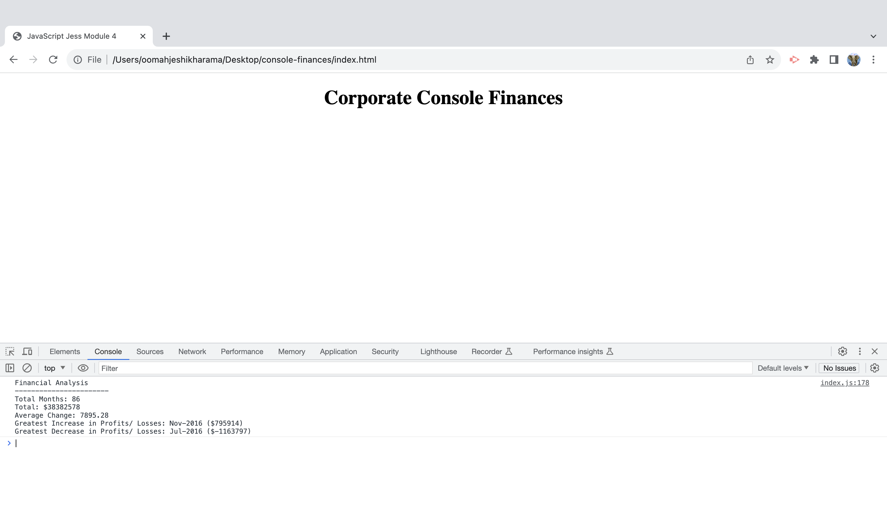

# Console Finances Analysis

## Overview
Console Finances Analysis is a JavaScript project that I have created to analyse financial records and to calculate various metrics such as total profits/losses, average changes, and identifying the greatest increases and decreases in profits over a given period. This project focuses on applying fundamental JavaScript concepts to real-world scenarios. Through this project, I gained hands-on experience in working with arrays, loops, conditionals, and string manipulation. The challenges encountered during the project enhanced my problem-solving skills and deepened my understanding of JavaScript concepts.

## Tools Used
* VS Code: Used to manipulate and analyse the provided financial dataset through JavaScript and HTML.
* Git and GitHub: Version control and collaboration platform for managing the project.

## Project Details
### Dataset Analysis
The financial dataset consists of arrays with two fields: Date and Profit/Losses. 
The following analyses are performed on the dataset:

* Calculating the total number of months included in the dataset.
* Computing the net total amount of Profit/Losses over the entire period.
* Determining the average of the changes in Profit/Losses over the entire period.
* To calculate the average change, the total change in profits is tracked from month to month, and the average is calculated using the formula: (Total Change / (Number of Months - 1)).
* Identifying the greatest increase in profits (date and amount) over the entire period.
* Identifying the greatest decrease in losses (date and amount) over the entire period.

## Challenges and Learning Curve
### Calculating Average Change: 
• Determining the correct formula for calculating the average change while considering the number of months was a significant challenge. 
### Research 
• MDN (Mozilla Developer Network) and guidance from my mentor Drew were instrumental in overcoming this challenge.
### String Concatenation: 
• Combining strings and variables for generating the analysis report required understanding the concept of string concatenation in JavaScript, which was supported by resources from MDN.
### Precision Rounding: 
• Achieving rounding to the nearest hundredth for the average change involved using appropriate JavaScript functions, with guidance from both MDN and my mentor.

## Collaborative Efforts
I received valuable guidance and support from my mentor Drew and collaborated with my classmates, who shared insights and ideas during our discussions. This collaborative learning environment contributed significantly to the project's successful completion.

## Project Outcome
The completed project successfully analyses the financial dataset and provides insights into total months, net total, average change, and the greatest increases and decreases in profits/losses. The final analysis is displayed in the console and follows the specified format.

## License

This project is licensed under the MIT License.

## Deployment - Useful Links to facilitate viewing of project

1. The URL of the GitHub repository:
https://github.com/Jeshikha/console-finances

2. The URL of the functional, deployed application on GitHub Pages:
https://jeshikha.github.io/console-finances/

## Screenshots of Deployed App

The following image shows the web application's console log and output through formula:

